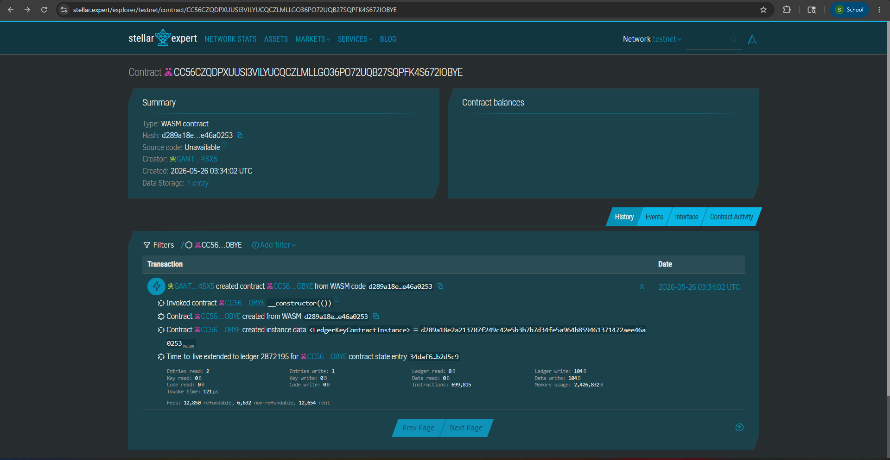

Here is the complete, unbroken README.md file from top to bottom. You can copy this entire block and paste it directly into your project!
code
Markdown
# BlockTag 🏷️
Bridging physical luxury items with digital immutability using Stellar Soroban.

---

## 📖 Project Overview

### Problem
A high-end sneaker and watch reseller in Greenhills, Manila, loses high-ticket sales because walk-in cash buyers cannot instantly verify if the luxury items are authentic, risking thousands of pesos on counterfeits.

### Solution
A trusted local authenticator mints a Soroban-based non-fungible certificate tied to a physical item's QR code. The app solves the trust problem by allowing the buyer to scan the QR, instantly verify that the current on-chain owner matches the physical seller, and safely receive the NFT upon cash payment. Stellar is essential here due to its extremely low transaction costs and fast settlement times, allowing real-time verification during an in-person meetup.

### Target Users
- **Who:** SME Merchant Resellers (streetwear/luxury vendors) and Unbanked/Cash Buyers.
- **Where:** Greenhills, Metro Manila, Philippines (SEA).
- **Why they care:** Sellers build trust and increase sales velocity; Buyers get immutable proof of authenticity without needing prior blockchain knowledge.

### Core Feature (MVP)
The specific transaction flow that proves the product works end-to-end:
1. **Authenticator Action:** Authenticator verifies the physical watch and calls `mint` on Soroban, issuing a digital certificate NFT to the Seller's wallet.
2. **Buyer Action (QR Scan):** Buyer scans the item's QR via the web app, which calls `get_owner` to confirm the on-chain certificate owner matches the physical Seller standing in front of them.
3. **Exchange Action:** Cash changes hands, and the Seller calls `transfer` to move the NFT to the Buyer's wallet.

### Why This Wins (Hackathon Edge)
This captures the "Real World Asset (RWA)" narrative by bridging physical local commerce with blockchain immutability. Judges will find it compelling because it targets a tangible, high-friction problem in local cash economies, utilizing Soroban to bypass the need for buyers to purchase crypto before buying a physical item.

**Optional Edge included:** A mobile-first Web App / PWA with a built-in camera QR scanner for seamless, no-code verification by the buyer.

---

## 🛠 Technical Details

### Timeline
This project is designed to be built within a bootcamp timeframe and the MVP flow can be demoed end-to-end in under 2 minutes.

### Stellar Features Used
- **Soroban Smart Contracts:** For custom NFT certificate minting, persistent state management, and transfer logic.
- **Custom Tokens:** Digital certificates acting as non-fungible digital twins to physical goods.

### Vision and Purpose
To eliminate fraud in the cash-heavy luxury resale market within Southeast Asia, acting as a true bridge between Real World Assets (RWA) and digital trust.

### Constraints & Themes Used
- **Region:** SEA (Philippines)
- **User Type:** SMEs, Unbanked/Cash-preferred
- **Complexity:** Soroban required, Web app
- **Theme:** Commerce & Loyalty (Marketplace escrow / Credential verification)

---

## 💻 Developer Guide

### Prerequisites
- Rust (latest stable version)
- Stellar CLI (v20.0.0 or later)
- A Stellar testnet account

### How to build
Navigate to your contract directory (e.g., `contracts/hello-world`) and run:
bash
stellar contract build

### How to test
The contract includes exactly 5 tests (Happy path, edge cases, and state verification) using soroban_sdk::testutils. To run them:
code
Bash
cargo test

### How to deploy to testnet
Ensure you have generated your identities/keys on the testnet first.
code
Bash
  --wasm target/wasm32-unknown-unknown/release/blocktag.wasm \
  --source-account admin_account \
  --network testnet

### Sample CLI Invocation (MVP Flow)
Here is the core MVP flow simulating the authentication, verification, and transfer. Replace <CONTRACT_ID> with your deployed contract hash.
1. contract Id:
Contract ID: CC56CZQDPXUUSI3VILYUCQCZLMLLGO36PO72UQB27SQPFK4S672IOBYE

link:
https://stellar.expert/explorer/testnet/contract/CC56CZQDPXUUSI3VILYUCQCZLMLLGO36PO72UQB27SQPFK4S672IOBYE

### License
MIT License
code
Code

## Screenshots
image: 